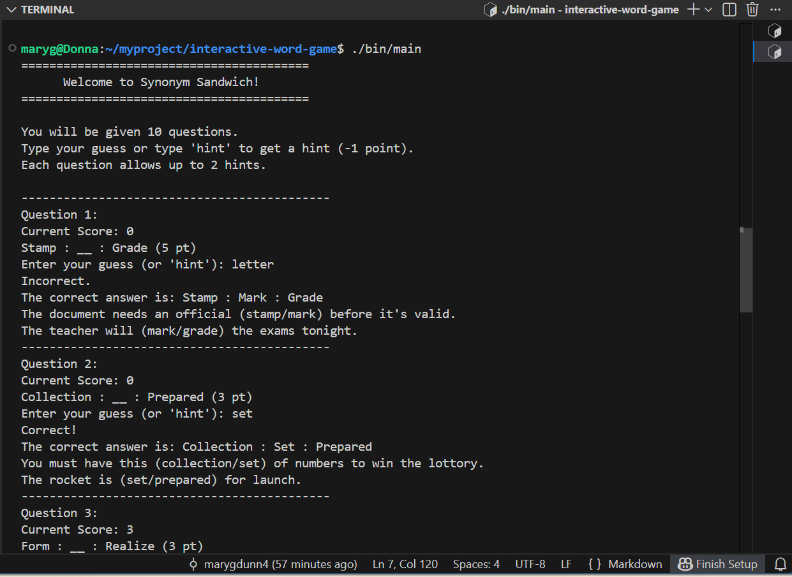

# Synonym Sandwich (C++ Word Game)

A command-line word game inspired by Merriam-Webster’s *Synonym Sandwich*,
where players guess a shared synonym that connects two related words.

This project was developed for a C++ programming course at Northeastern University
and focuses on game logic, data structures, and user interaction design.

📄 Full rules and scoring breakdown available in [`/docs/game-play.md`](docs/game-play.md)

## 🛠 Tech

**Language:** C++  

**Concepts:**
- Object-oriented design  
- STL containers  
- Randomization and state management  
- Input validation  
- File-based question datasets  

## 🚀 What I Learned

- Designing rule-based game systems in C++
- Managing complex state across multiple rounds
- Writing maintainable, modular code
- Thinking about user experience without a graphical interface

## 🔮 Future Improvements

- Add difficulty levels
- Expand question dataset
- Implement a graphical or web-based version
- Add multiplayer or timed modes

## 📚 Acknowledgements

Inspired by Merriam-Webster’s *Synonym Sandwich* word game.
